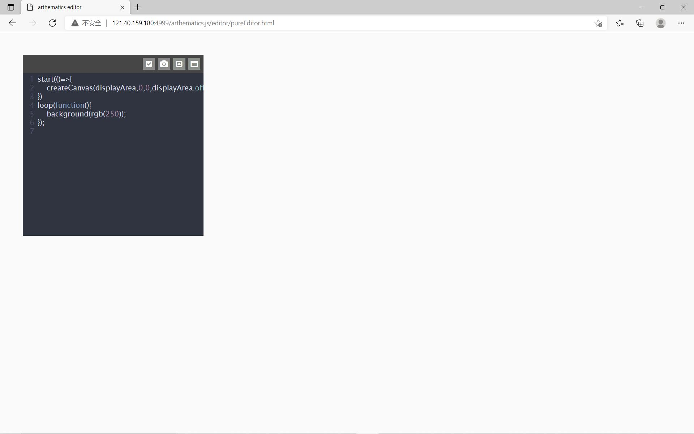
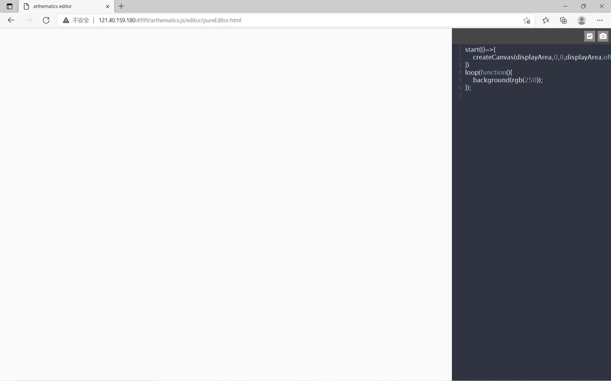
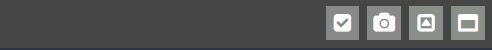
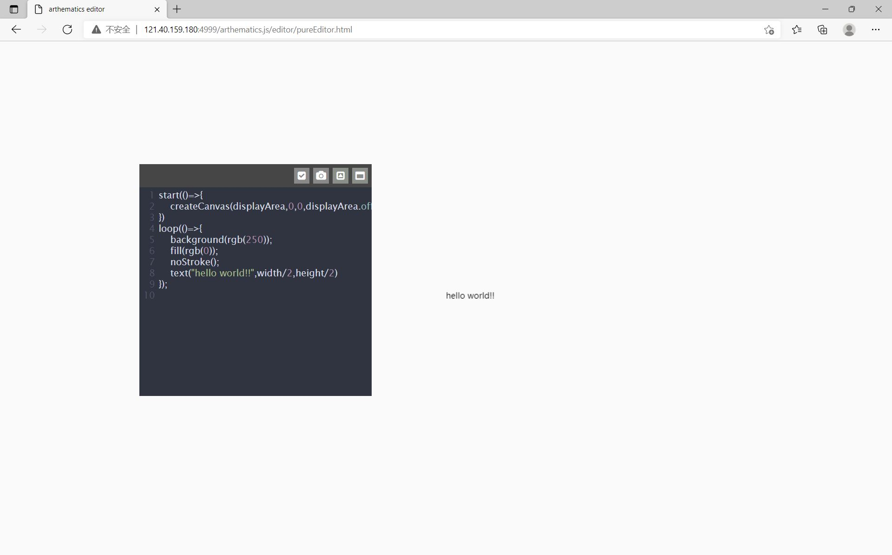
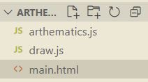
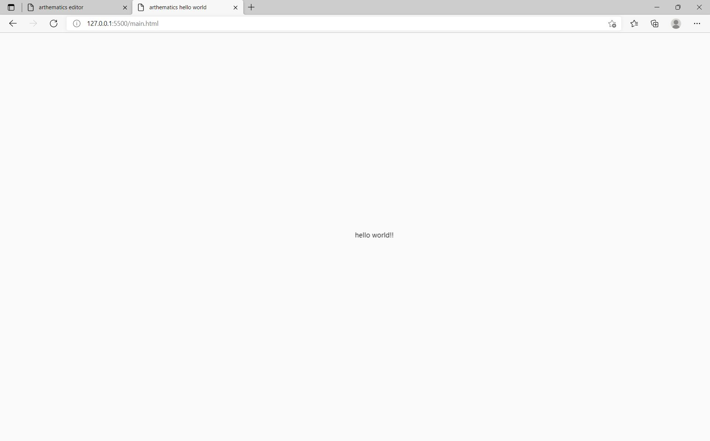

## Section1
#  起步：一元函数
那是一条无限光滑的曲线，无论怎么放大，都是一如既往的干净——整整齐齐地将平面划分为两个区域。

### 1.1 环境搭建
接下来的所有内容，我们会基于arthematics.js来讲述，虽然HTML5标准自己也提供了canvas规范用来作图，但其过程较为繁杂，arthematics是对这一过程的简化，并且从设计之初就为本书中会提到的一些数学模型提供了许多便利。
arthematics提供了在线的编辑器，也支持作为JS库下载后使用，本书着重使用在线编辑器进行讲解，但也会粗略介绍如何在本地使用arthematics。
#### 1.1.1 在在线编辑器中使用arthematics
在在线编辑器使用可以省去配置环境的工作，支持所见即所得的实时代码执行。
##### 平台介绍
打开网址：
http://121.40.159.180:4999/arthematics.js/editor/pureEditor.html
倘若服务器健在的话，你应该能看到在线编辑器的界面



左上角的深灰色窗体为代码编写区，将鼠标放在其上方的浅色横栏中可以拖动窗体，当窗体位于屏幕左侧或右侧时会自动停靠



编辑器横栏上的四个按钮分别为：状态指示、保存图片、最小化编辑区以及最大化编辑区



最左边的状态指示图标表示当前代码是否正在运行，当其中的图标变为感叹号时表示编辑区中的代码存在语法错误。
点击从左到右的第二个按钮，可以保存当前画板上的图像并下载到本地。
点击从左到右的第三个按钮，编辑区将最小化显示，再次点击恢复到原来大小。
最右边的按钮用于将代码编辑区最大化，再次点击恢复初始大小。

##### 第一段程序 Arthematics Hello World !
现在让我们使用arthematics绘制第一幅图像。

在代码编辑区的
```javascript
background(rgb(250));
```
后插入
```javascript
fill(rgb(0));
noStroke();
text("hello world!!",width/2,height/2)
```
现在编辑区中的代码应该是这个样子的：
```javascript
start(()=>{
    createCanvas(displayArea);
})
loop(()=>{
    background(rgb(250));
    fill(rgb(0));
	noStroke();
    text("hello world!!",width/2,height/2);
});
```
不出意外的话，你应该能看到画布中心出现了 hello world!! 的字符，如下图所示。



倘若程序没有按照预期运行，请检查代码中是否混入了中文的逗号、分号、括号等等，这是许多编程初学者会遇到的问题，此外，请检查括号是否闭合或者多写。

    NOTICE:
    在编写代码的过程中保持英语输入是一个比较好的编码习惯。

如果一切都按照预期进行了，点击编辑窗口上的照相机将图片保存到本地，Congratulations!

#### 1.1.2 在本地编辑器使用arthematics
倘若本地的一些代码编辑器更对你的口味，你也可以将arthematics下载到本地使用。

在这个链接中下载arthematics.js：
http://121.40.159.180:4999/arthematics.js/arthematics.js

##### 在 Visual Studio Code 中使用 arthematics 进行创作
Visual Studio Code（VSCode）支持 MacOS、Windows、Linux 平台，并且对JavaScript有非常好的支持性。此处以VSCode为例进行讲解。

新建main.html作为执行程序的载体，新建draw.js作为arthematics代码编写的区域，并且将下载的arthematics.js放入文件夹内。

现在文件目录看起来应该是这个样子：



在main.html中引入相关文件：
```html
<!DOCTYPE html>
<html>
<head>
    <meta charset="UTF-8">
    <meta http-equiv="X-UA-Compatible" content="IE=edge">
    <meta name="viewport" content="width=device-width, initial-scale=1.0">
    <title>arthematics hello world</title>
    <style>
        *{
            margin: 0;
            padding: 0;
        }
        body{
            width: 100vw;
            height: 100vh;
            background-color: white;
        }
    </style>
</head>
<body>
    <script src="./arthematics.js"></script>
    <script src="./draw.js"></script>
</body>
</html>
```
此处的CSS样式是为了让画布满屏显示，倘若你不介意四周有边框的话，可以不写style标签。

在draw.js中编写：
```javascript
start(()=>{
    createCanvas(document.body);
})
loop(()=>{
    background(rgb(250));
    fill(rgb(0));
	noStroke();
    text("hello world!!",width/2,height/2);
});
```

现在用浏览器打开main.html，如果你的VSCode装有类似live server这些插件则一键建立本地服务器。

在浏览器中你应该能看到屏幕中心的"hello world!!"。



那么，恭喜你，本地开发环境搭建成功！

### 1.2 arthematics快速入门
如你所见，当你打开arthematics的在线编辑平台时，编辑器中已经有一段框架代码了：
```javascript{.line-numbers}
start(()=>{
    createCanvas(displayArea);
})
loop(()=>{
    background(rgb(250));
});
```
在大多数情况下，这些代码是无需更改的，第一行的start函数会在程序loop之前执行，之后，loop函数会以最快的速度进行循环。

